# Guida utente di Hodum

Questa guida spiega come usare Hodum dal punto di vista di chi lo usa ogni giorno: il titolare di un'azienda (**owner**), un **project manager** o un **dipendente**. Per l'installazione e la configurazione tecnica vedi il [README](../README.md).

Hodum è pensato per girare sulla rete interna dell'azienda (vedi la sezione "Modello di rete e accesso remoto" del README): l'indirizzo con cui lo raggiungi te lo comunica chi lo ha installato.

## Indice

1. [Primo accesso](#1-primo-accesso)
2. [Panoramica dell'interfaccia](#2-panoramica-dellinterfaccia)
3. [Ruoli e permessi](#3-ruoli-e-permessi)
4. [Dashboard e progetti](#4-dashboard-e-progetti)
5. [Gestione dei task](#5-gestione-dei-task)
6. [Dipendenti](#6-dipendenti)
7. [Gestione aziendale](#7-gestione-aziendale)
8. [Assistente AI](#8-assistente-ai)
9. [Notifiche](#9-notifiche)
10. [Profilo utente e lingua](#10-profilo-utente-e-lingua)
11. [Domande frequenti](#11-domande-frequenti)

---

## 1. Primo accesso

### 1.1 Creare l'azienda (registrazione)

Se sei la prima persona della tua azienda a usare Hodum, dalla schermata di accesso scegli **"Non hai un account? Registrati"**. Il form crea contemporaneamente l'azienda e il tuo account, che diventa automaticamente **owner** (proprietario).

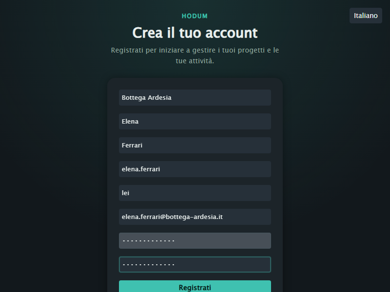

Campi richiesti: nome azienda, nome, cognome, email e password. Username e pronome sono opzionali. La password deve avere **almeno 8 caratteri, con almeno una lettera minuscola, una maiuscola e una cifra**.

Se invece la tua azienda ha già un'installazione Hodum altrove e vuoi migrare i dati, dal link **"Hai un export da un'altra installazione? Importa azienda"** puoi caricare il file JSON esportato dalla vecchia installazione (vedi [7.5](#75-esportare-i-dati-dellazienda)) invece di ripartire da zero.

### 1.2 Il codice di recupero

Subito dopo la registrazione, Hodum mostra un **codice di recupero** univoco.

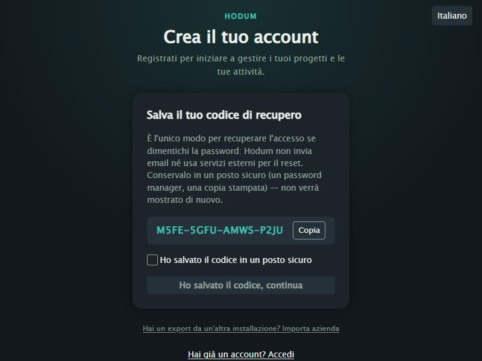

Questo codice è **l'unico modo per reimpostare la password se la dimentichi**: Hodum non invia email né usa servizi esterni per il reset. Salvalo subito in un posto sicuro (un password manager, una copia stampata) — non verrà mostrato di nuovo. Puoi copiarlo con il pulsante dedicato prima di confermare di averlo salvato.

### 1.3 Accesso (login)

Nella schermata di accesso inserisci email e password. La casella **"Ricordami"** allunga la durata della sessione sul dispositivo che stai usando.

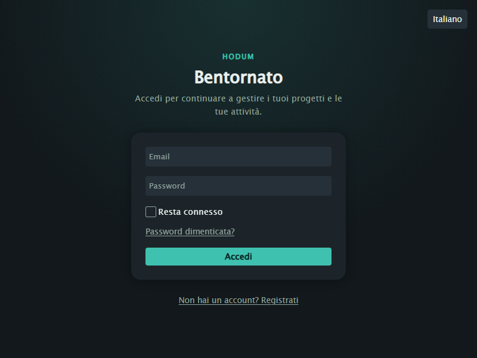

Dopo **troppi tentativi falliti consecutivi**, l'accesso a quell'account viene bloccato temporaneamente (15 minuti): un messaggio mostra il conto alla rovescia prima di poter riprovare. Se il tuo account è stato **bloccato dall'owner** (vedi [6.2](#62-modificare-bloccare-ed-eliminare-un-dipendente)), il login rifiuta l'accesso con un messaggio dedicato, indipendentemente dalla password.

### 1.4 Password dimenticata

Dal link **"Password dimenticata?"** sotto il form di login si arriva alla pagina di recupero: qui servono l'email dell'account **e** il codice di recupero ricevuto alla registrazione (formato `XXXX-XXXX-XXXX-XXXX`) per impostare una nuova password.

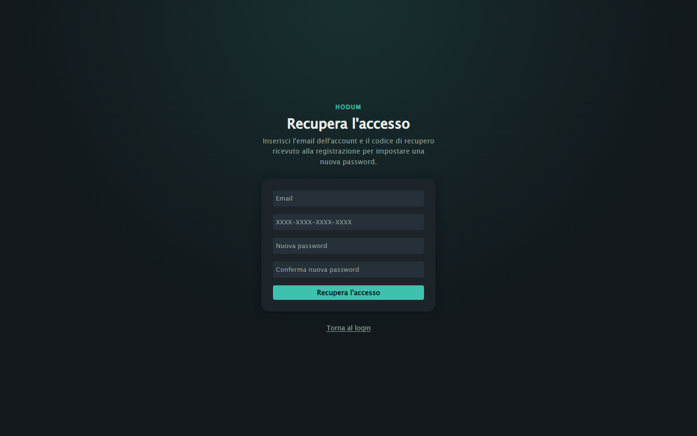

Senza il codice di recupero non è possibile reimpostare la password: è per questo che va conservato con cura fin dal primo giorno.

### 1.5 Cambio password obbligatorio

Quando l'owner crea un nuovo dipendente o project manager, gli assegna una **password iniziale temporanea** (vedi [6.1](#61-creare-un-dipendente)). Al primo accesso con quella password, Hodum reindirizza automaticamente a una schermata che obbliga a impostarne una nuova prima di poter usare il resto dell'app.

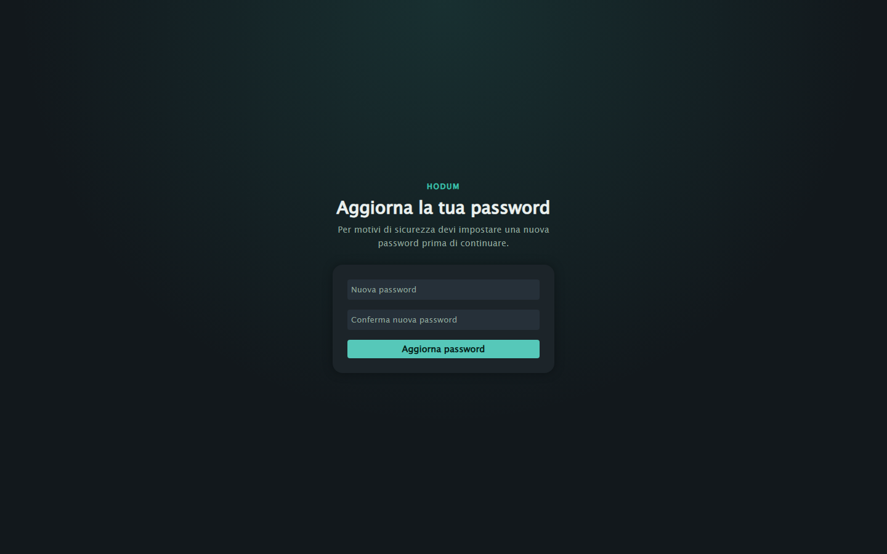

---

## 2. Panoramica dell'interfaccia

Una volta autenticati, la barra in alto (sempre visibile) contiene, da sinistra a destra:

- **Hodum** — logo, torna alla Dashboard.
- **Dashboard** — l'elenco dei tuoi progetti.
- **Progetti ⌄** — un menu a tendina con l'elenco rapido dei progetti a cui hai accesso, per saltare da uno all'altro senza passare dalla Dashboard. Quando sei dentro un progetto, il suo nome compare accanto alla voce.
- **Nome dell'azienda**, al centro.
- **Gestione aziendale** — visibile solo a owner e project manager (vedi [3](#3-ruoli-e-permessi)).
- **Selettore lingua** (Italiano/English), la campanella delle **notifiche** e l'**avatar** dell'account, con le iniziali del tuo nome.

In basso a destra, su ogni pagina, trovi due pulsanti flottanti: il fumetto per aprire l'**Assistente AI** (vedi [8](#8-assistente-ai)) e, dove applicabile, il pulsante **"+"** per creare rapidamente un progetto o un task.

---

## 3. Ruoli e permessi

Ogni persona in Hodum ha uno di tre ruoli:

| Ruolo | Cosa può fare |
|---|---|
| **Owner** (proprietario) | Accesso completo: crea/gestisce dipendenti e project manager, dati aziendali, clienti, fatture, backup, esportazione ed eliminazione dell'azienda. È unico per azienda (l'account creato in registrazione). |
| **Project manager** | Vede "Gestione aziendale", ma solo la card **Dipendenti** (per assegnare progetti — non può creare/modificare/eliminare dipendenti, né i loro dati). Lavora sui progetti a cui è stato assegnato come farebbe un dipendente. |
| **Dipendente** | Vede solo i progetti a cui è stato assegnato (come progetto o come assegnatario di singoli task). Nessun accesso a "Gestione aziendale": niente creazione progetti dalla Dashboard, niente pulsante "Importa progetto". |

Un punto importante e poco intuitivo: **essere assegnatario di un task non basta per vedere il progetto in Dashboard**. L'owner (o il project manager, per i propri progetti) deve assegnare esplicitamente il progetto alla persona da **Dipendenti → menu ⋮ → Assegna progetti** (vedi [6.2](#62-modificare-bloccare-ed-eliminare-un-dipendente)) — altrimenti il dipendente vede "Nessun progetto ancora" anche se ha un task assegnato.

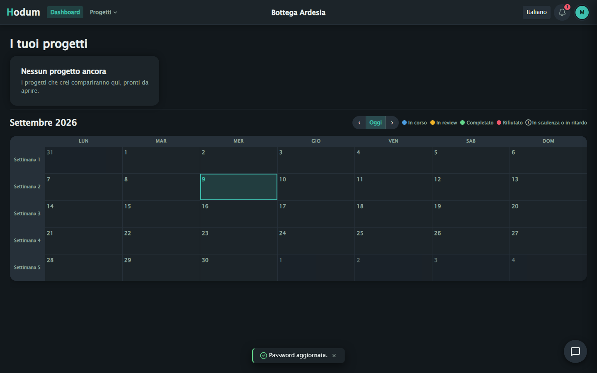
*Vista Dashboard di un dipendente: niente "Importa progetto", niente pulsante "+" per creare un progetto, niente "Gestione aziendale".*

Le card riservate solo all'owner dentro "Gestione aziendale" (Modifica dati aziendali, Clienti, Fatture, Backup, Esporta dati azienda, Elimina azienda) toccano l'infrastruttura e la contabilità dell'azienda, non la gestione operativa quotidiana.

---

## 4. Dashboard e progetti

La Dashboard è la pagina che si apre dopo il login: mostra i tuoi progetti e, sotto, un calendario mensile con tutti i task di tutti i tuoi progetti.

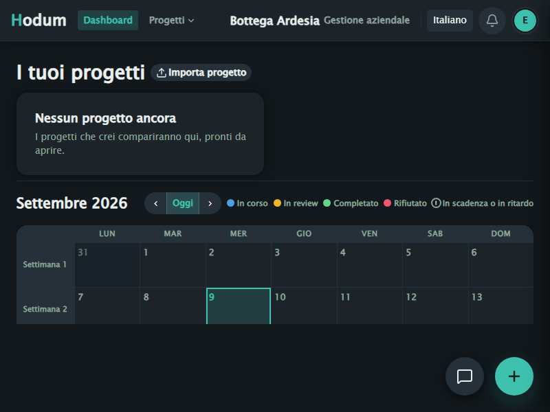

### 4.1 Creare un progetto

Con il pulsante **"+"** in basso a destra (visibile a owner e project manager) si apre il modulo di creazione: basta un nome.

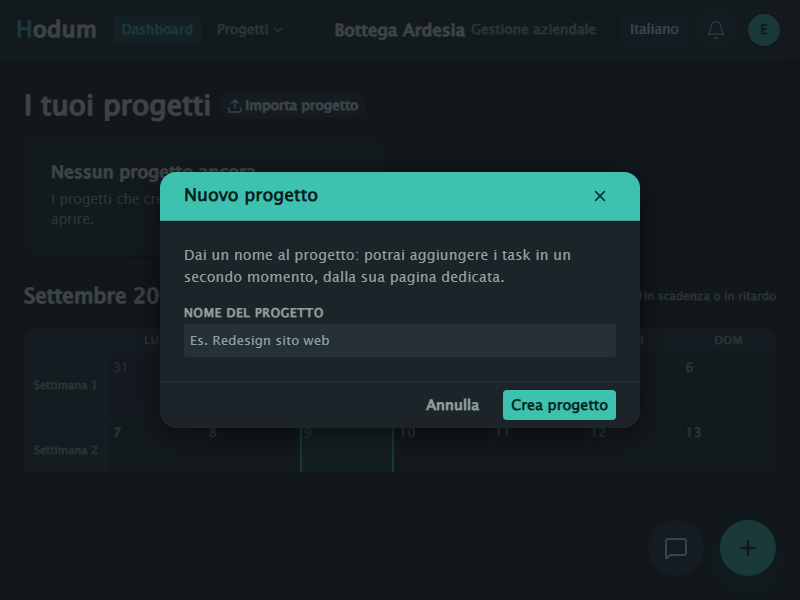

Ogni progetto creato compare come una scheda con un **grafico a ciambella** che riassume a colpo d'occhio quanti task sono in corso, in review, completati o rifiutati.

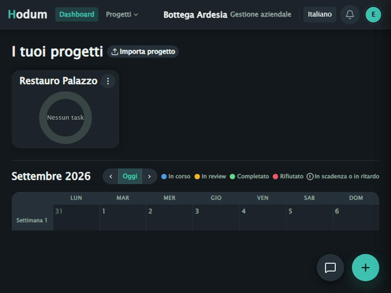

Sotto le schede, il **calendario mensile** riporta un pallino colorato nei giorni con una scadenza (blu = in corso, giallo = in review, verde = completato, rosso = rifiutato) e un'icona di avviso (!) per le scadenze imminenti o superate. Con **‹ Oggi ›** si naviga tra i mesi.

### 4.2 Modificare, eliminare o scaricare un progetto

Il menu **⋮** su ogni scheda progetto apre tre azioni:

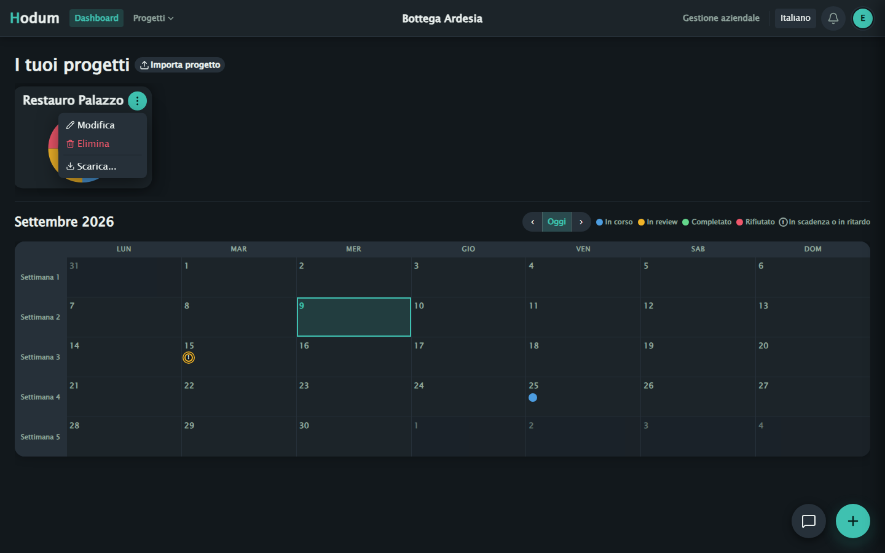

- **Modifica** — rinomina il progetto e, opzionalmente, gli assegna un **cliente** (necessario per poter poi generare fatture sui task di quel progetto, vedi [7.3](#73-fatture)).

  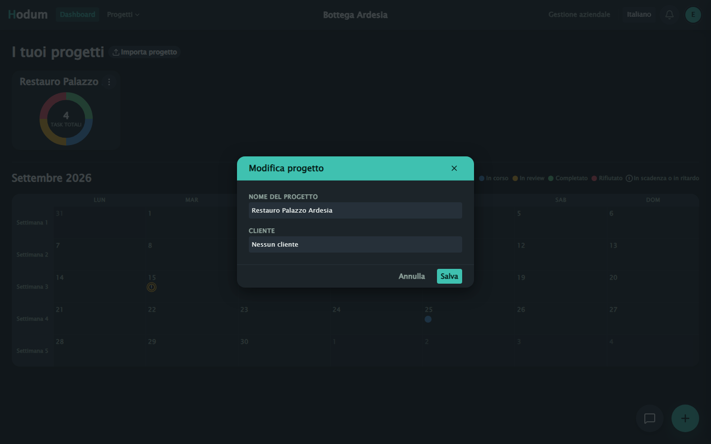

- **Elimina** — richiede conferma; rimuove il progetto e tutti i suoi task.
- **Scarica...** — esporta i dati del progetto (nome, task, assegnatari) in uno di quattro formati.

  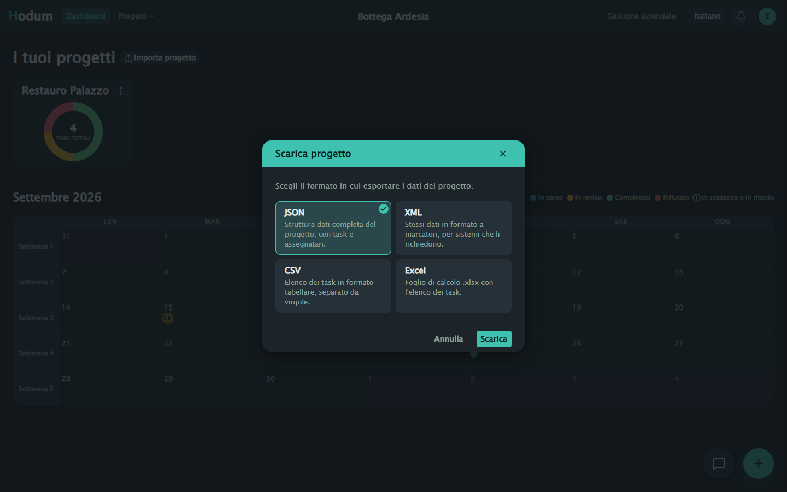

  - **JSON** — struttura dati completa, è il formato da usare per **reimportare** il progetto (anche in un'altra installazione Hodum, vedi sotto).
  - **XML** — stessi dati in formato a marcatori, per sistemi esterni che lo richiedono.
  - **CSV** — solo l'elenco dei task, tabellare, separato da virgole.
  - **Excel** — foglio di calcolo `.xlsx` con l'elenco dei task.

### 4.3 Importare un progetto

Il pulsante **"Importa progetto"** in alto nella Dashboard permette di ricreare un progetto a partire da un file **JSON** scaricato in precedenza da Hodum stesso: viene creato un nuovo progetto con gli stessi task. Gli assegnatari **non** vengono importati (gli ID utente non hanno significato nella nuova azienda).

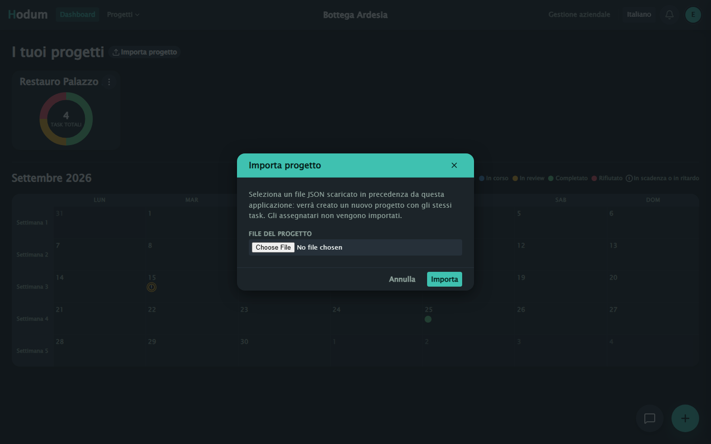

---

## 5. Gestione dei task

Aprendo un progetto (click sulla sua scheda in Dashboard, o dal menu "Progetti" in alto) si arriva all'elenco dei suoi task, con tre modi di visualizzarli.

### 5.1 Le tre viste

**Lista** — task raggruppati per stato (In corso, In review, Completati, Rifiutati), con colonne per stato, priorità, timer di lavoro e assegnatari, tutti modificabili direttamente dalla riga.

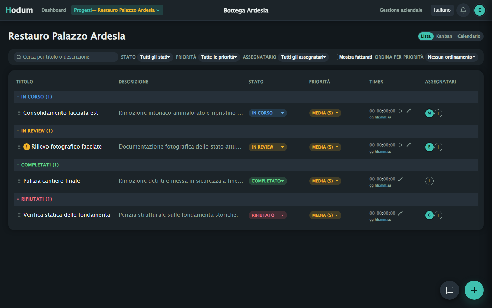

**Kanban** — le stesse quattro colonne, in formato bacheca, per una visione più visiva dell'avanzamento.

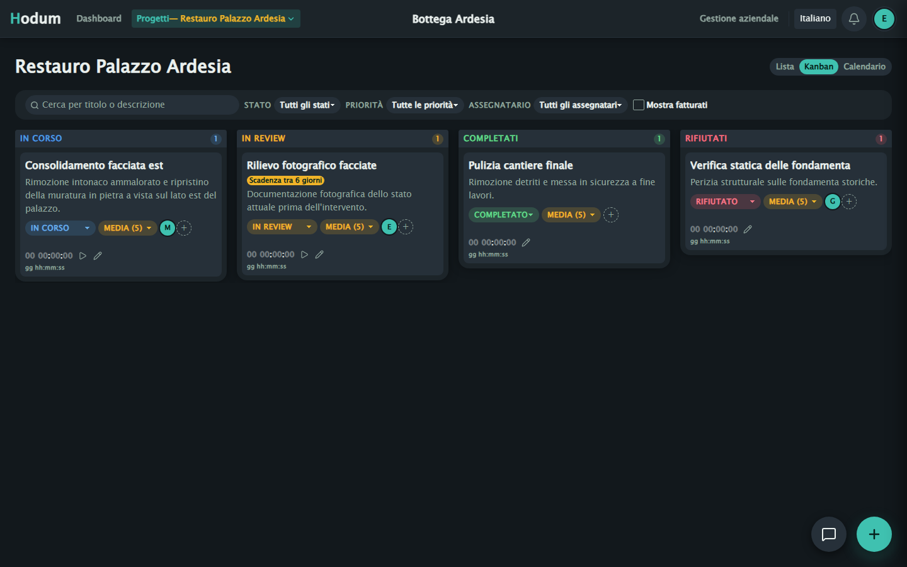

**Calendario** — i task del solo progetto aperto, posizionati nel giorno di scadenza.

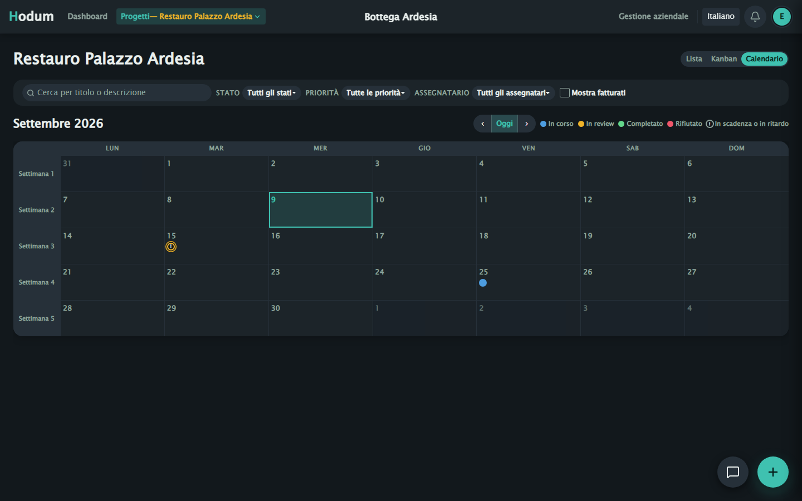

La vista scelta resta memorizzata: tornando sullo stesso progetto (o su un altro) si ritrova l'ultima vista usata.

### 5.2 Filtri e ricerca

Sopra l'elenco/bacheca trovi: ricerca testuale per titolo o descrizione, filtro per **stato**, per **priorità** (Alta 1-3, Media 4-6, Bassa 7-10), per **assegnatario**, l'ordinamento **"per priorità"** (più o meno urgenti prima) e la casella **"Mostra fatturati"**, che di norma nasconde i task già inclusi in una fattura (vedi [5.7](#57-task-fatturati-sola-lettura)).

### 5.3 Creare un task

Un progetto appena creato parte senza task:

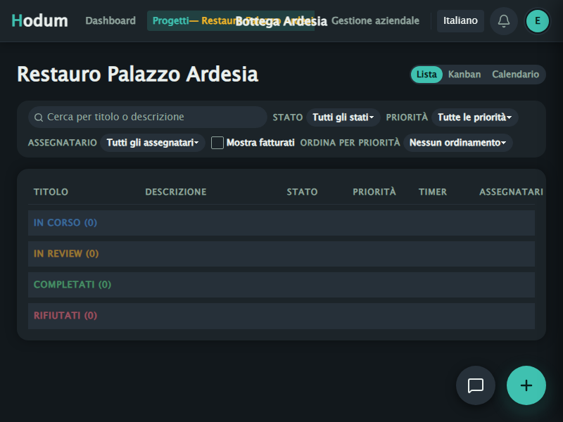

Dal pulsante **"+"**: titolo obbligatorio, descrizione e data di scadenza opzionali, più stato e priorità (con valori predefiniti "In corso" e "Media (5)").

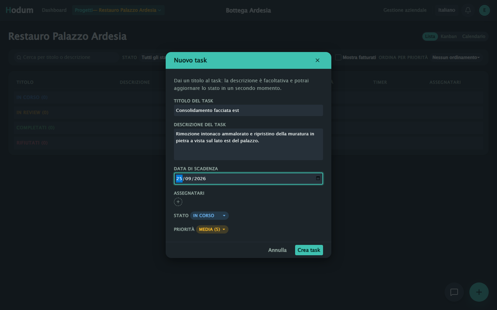

Dal pulsante **"+"** sotto "Assegnatari" si apre l'elenco dei dipendenti/manager assegnabili, con un cerchietto colorato per iniziali.

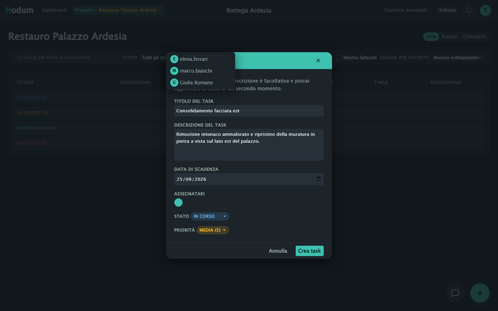

Un task può avere più assegnatari contemporaneamente.

### 5.4 Scadenze in evidenza

Un task ancora aperto (non completato né rifiutato) con scadenza entro **7 giorni** mostra un'etichetta gialla **"Scadenza tra N giorni"**; se la data è già passata, l'etichetta diventa un avviso di ritardo. Un task completato o rifiutato non mostra mai questi avvisi, anche se la scadenza originale è nel passato: non è più un rischio.

### 5.5 Dettaglio, modifica e commenti

Cliccando su un task (in Lista o in Kanban) si apre il pannello di dettaglio: a sinistra titolo, descrizione, scadenza e assegnatari modificabili; a destra i **commenti**, per lasciare note visibili a tutta la squadra assegnata al task.

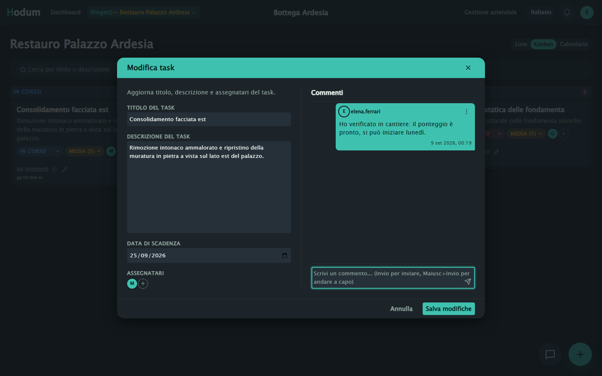

### 5.6 Timer di lavoro

Ogni task ha un cronometro (formato `gg hh:mm:ss`) per tracciare il tempo effettivamente lavorato, con controlli avvia/pausa/termina/azzera visibili sia in Lista sia in Kanban.

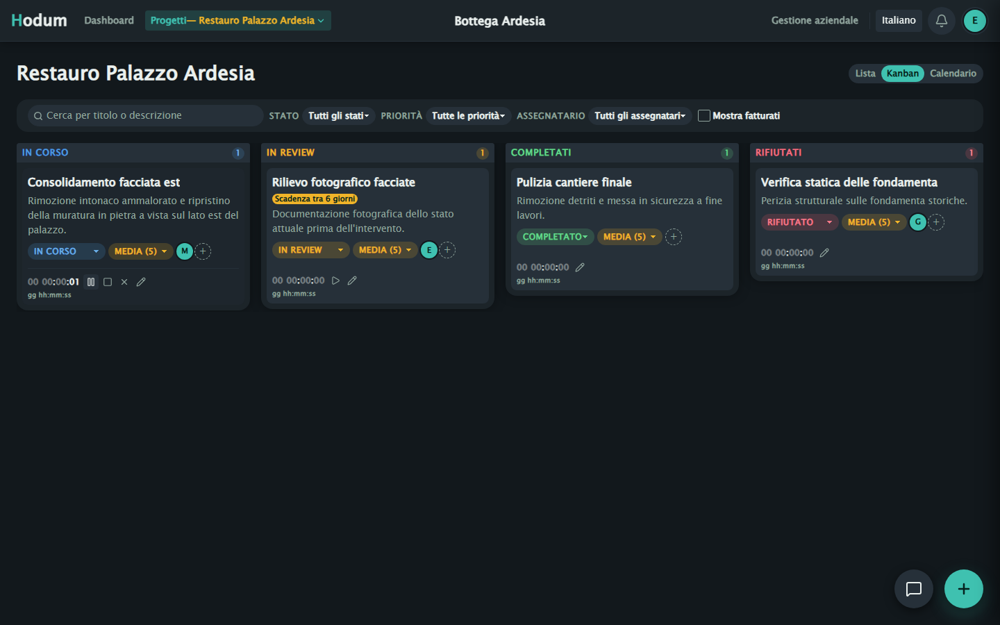

- ▶ **Avvia** — parte il conteggio.
- ⏸ **Pausa** — sospende il conteggio, il tempo accumulato resta.
- ⏹ **Termina** — chiude la sessione di lavoro corrente.
- ✕ **Azzera** — riporta il tempo accumulato a zero (irreversibile).

Se ti sei dimenticato di avviare o fermare il timer, l'icona a matita apre un **editor manuale** (giorni/ore/minuti/secondi) per correggere il tempo accumulato senza dover simulare avvio/stop.

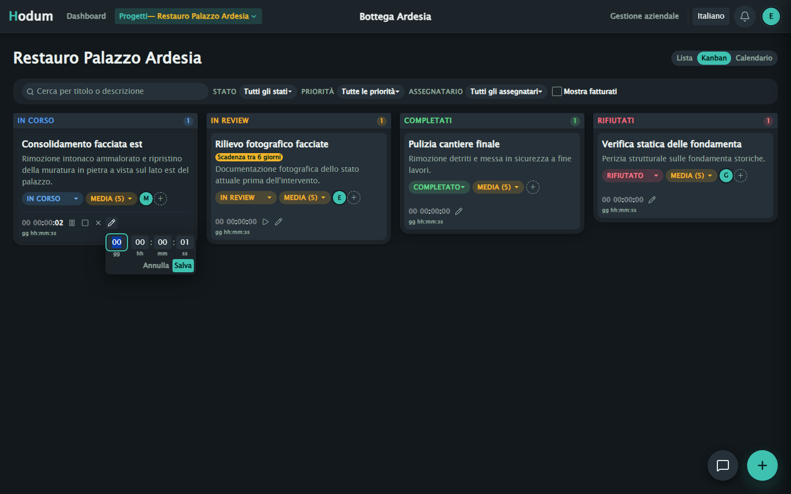

Quando un task passa a "Completato" o "Rifiutato", il timer si ferma automaticamente e i controlli spariscono: resta solo il tempo accumulato, congelato.

### 5.7 Task fatturati (sola lettura)

Un task incluso in una pre-fattura confermata (vedi [7.3](#73-fatture)) diventa **di sola visualizzazione**: un lucchetto compare accanto al titolo, il timer perde i controlli e il task non può più essere modificato — coerenza con l'importo già fatturato al cliente.

Per impostazione predefinita questi task **restano nascosti** dall'elenco/bacheca (per non affollare la vista con lavoro ormai chiuso):

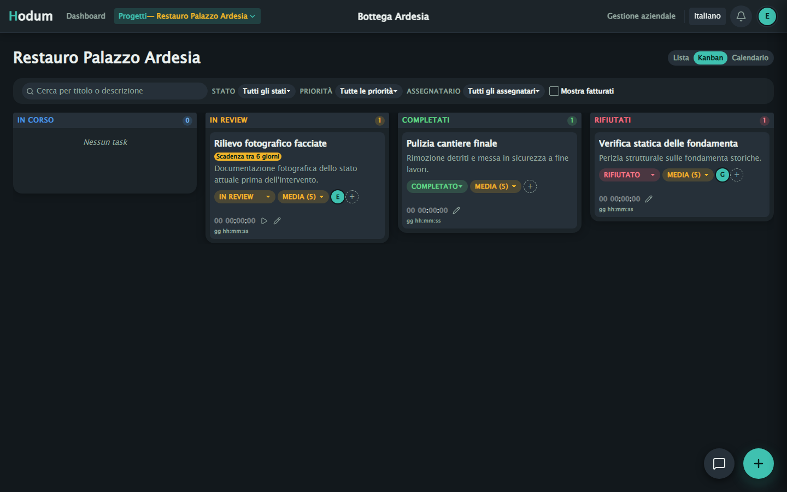

La casella **"Mostra fatturati"** li fa ricomparire, con il lucchetto ben visibile:

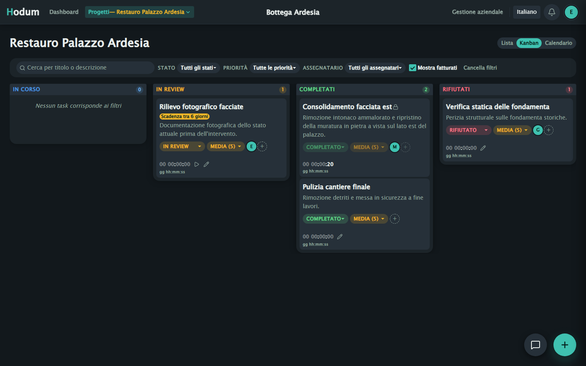

---

## 6. Dipendenti

Da **Gestione aziendale → Dipendenti** (owner e project manager) si gestisce chi lavora nell'azienda su Hodum.

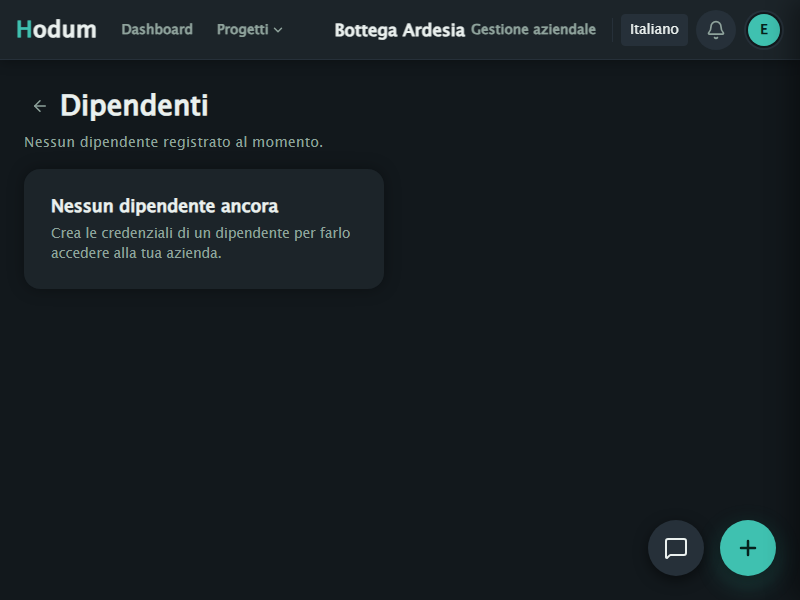

### 6.1 Creare un dipendente

Solo l'owner può creare nuovi account (il pulsante "+" non è visibile al project manager). Servono nome, cognome, email, ruolo (Dipendente o Project Manager) e una **password iniziale** da comunicare fuori banda alla persona: al primo accesso le verrà chiesto di sostituirla (vedi [1.5](#15-cambio-password-obbligatorio)).

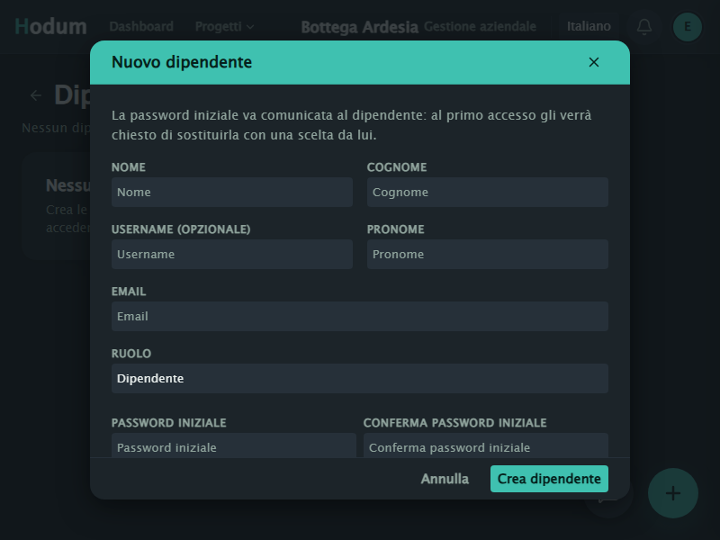

L'elenco mostra, per ciascuno, un badge del ruolo e lo stato dell'accesso ("In attesa del primo accesso" finché non effettua il login):

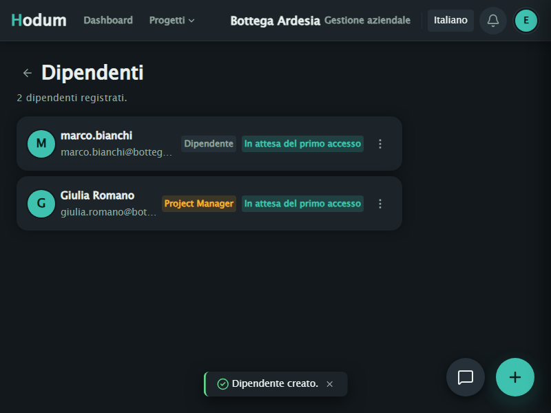

### 6.2 Modificare, bloccare ed eliminare un dipendente

Il menu **⋮** su ogni riga offre:

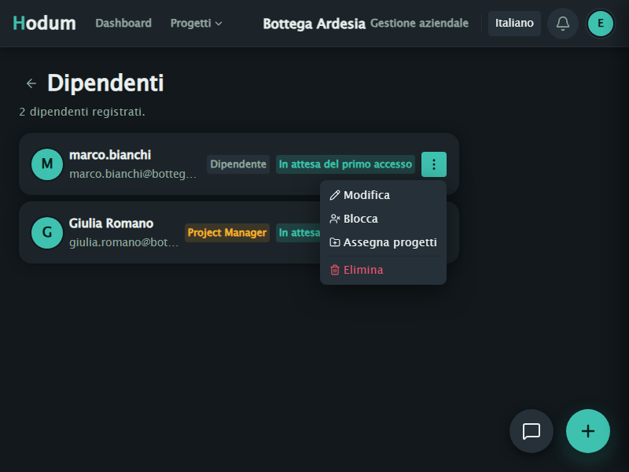

- **Modifica** — dati anagrafici, ruolo, email (owner-only).
- **Blocca** — impedisce l'accesso senza cancellare nulla; i dati restano intatti e la persona può essere riabilitata in seguito. Utile per un dipendente in pausa o in uscita dall'azienda.

  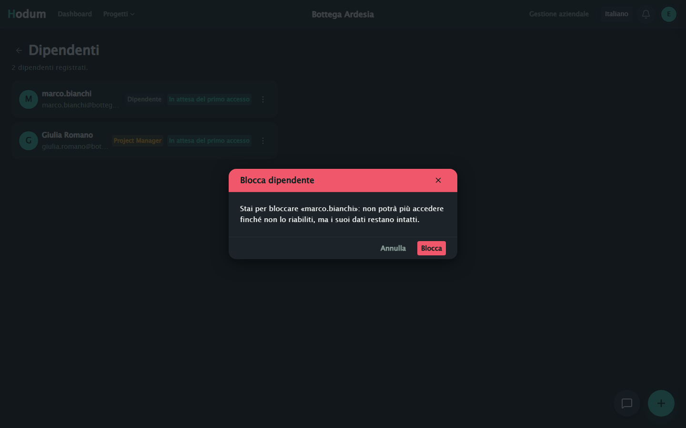

- **Assegna progetti** — apre un sotto-menu con la casella di spunta per ciascun progetto: è **questo** il passaggio che rende un progetto visibile al dipendente/manager (vedi [3](#3-ruoli-e-permessi)), disponibile anche al project manager.

  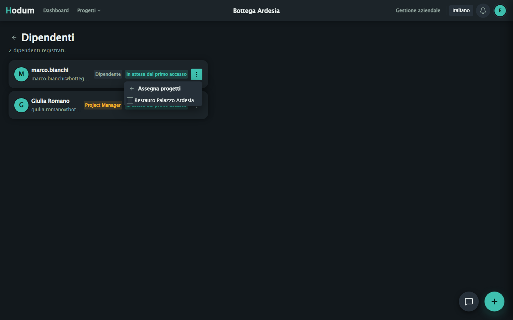

- **Elimina** — rimuove definitivamente l'account e le sue assegnazioni ai progetti (owner-only, non reversibile).

---

## 7. Gestione aziendale

Da **Gestione aziendale** (owner e project manager vedono la card Dipendenti; le altre sono owner-only) si raggiungono tutti gli strumenti amministrativi.

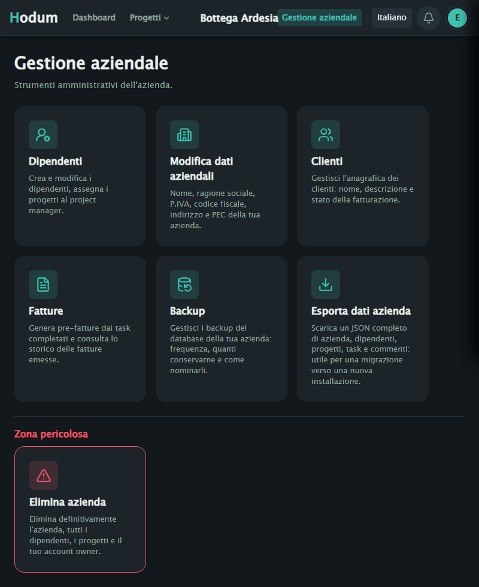

### 7.1 Dati aziendali

Ragione sociale, P.IVA, codice fiscale, indirizzo e PEC, più la **tariffa aziendale predefinita** (oraria, giornaliera, settimanale, mensile o annuale) e la **valuta**. Se scegli una tariffa non oraria, imposta anche i **giorni e l'orario di lavoro** dell'azienda: servono a Hodum per convertire il tempo lavorato in un importo coerente con quella periodicità.

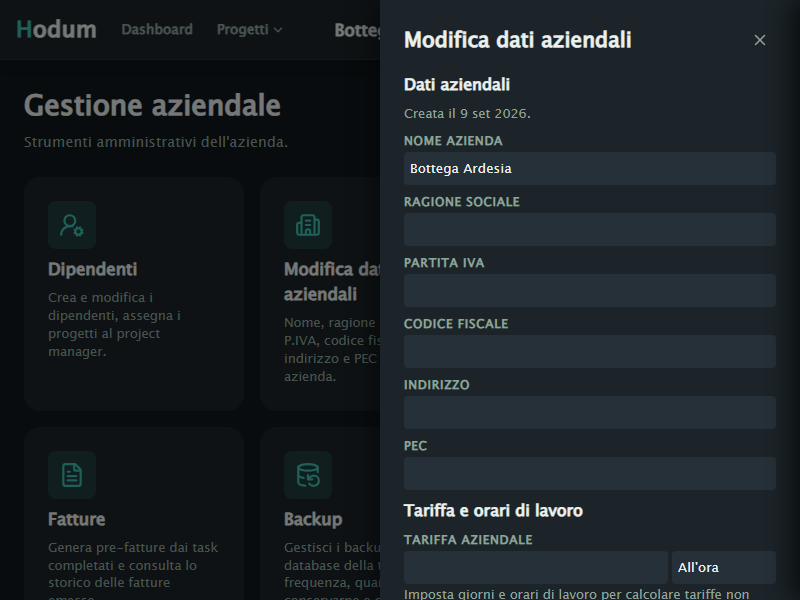

### 7.2 Clienti

L'anagrafica clienti: nome, descrizione, e opzionalmente una tariffa e valuta **specifiche per quel cliente** (altrimenti si usa quella aziendale di default).

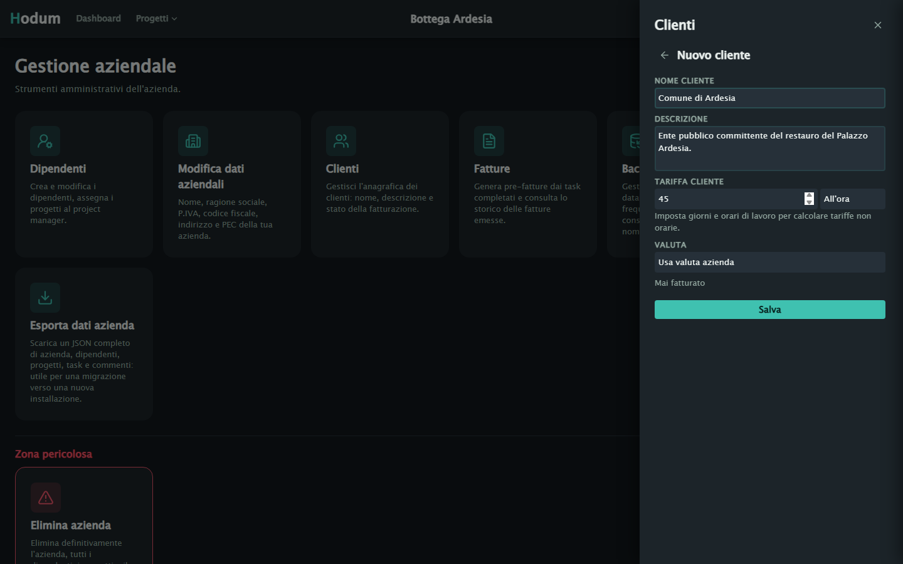

Ogni cliente registrato mostra se è già stato fatturato almeno una volta.

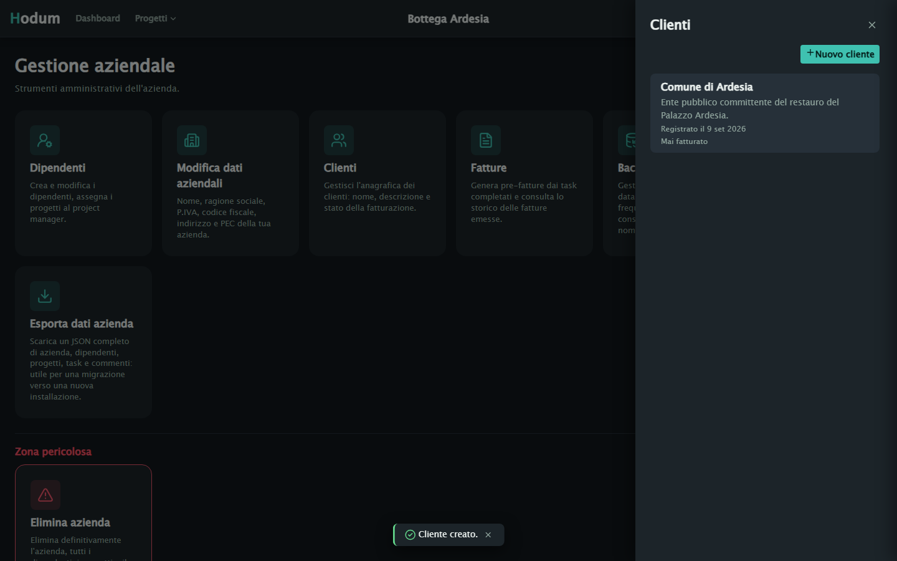

Un cliente deve esistere prima di poter essere assegnato a un progetto (vedi [4.2](#42-modificare-eliminare-o-scaricare-un-progetto)) e prima di generare fatture sui suoi progetti.

### 7.3 Fatture

Da **Gestione aziendale → Fatture** si generano le **pre-fatture**: documenti che riepilogano il tempo lavorato (e il relativo importo) sui task completati e fatturabili di un cliente.

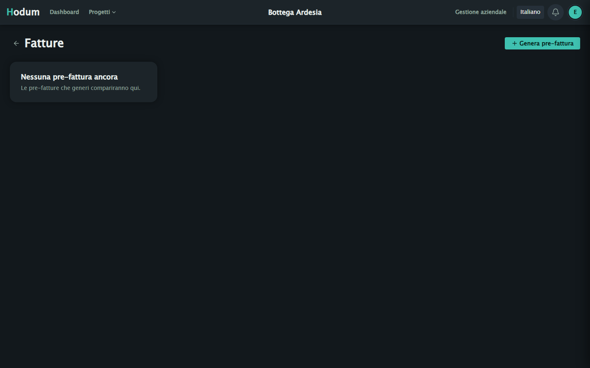

Il flusso:

1. **Genera pre-fattura** → scegli il cliente (e opzionalmente un singolo progetto) → Hodum elenca i task fatturabili di quel cliente con il tempo lavorato su ciascuno.
2. Spunta i task da includere (puoi anche marcare un task come **"Non fatturabile"** per escluderlo pur lasciandolo nell'elenco).

   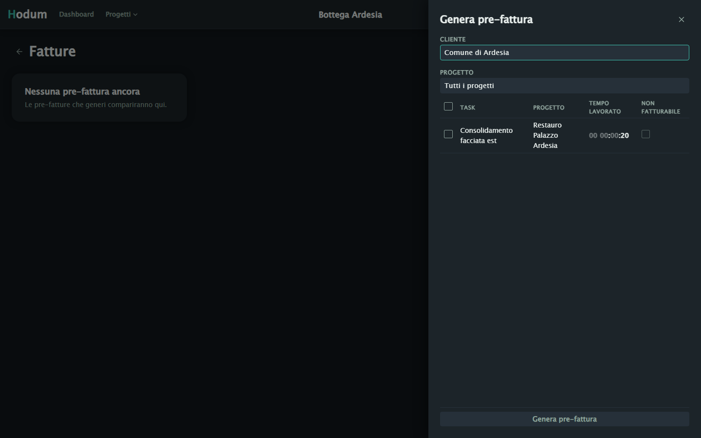

3. Hodum genera un'**anteprima PDF** della fattura: da qui puoi tornare indietro ("Modifica") o confermarla.
4. Una volta confermata, la pre-fattura riceve un numero progressivo e i task inclusi diventano di sola lettura (vedi [5.7](#57-task-fatturati-sola-lettura)).

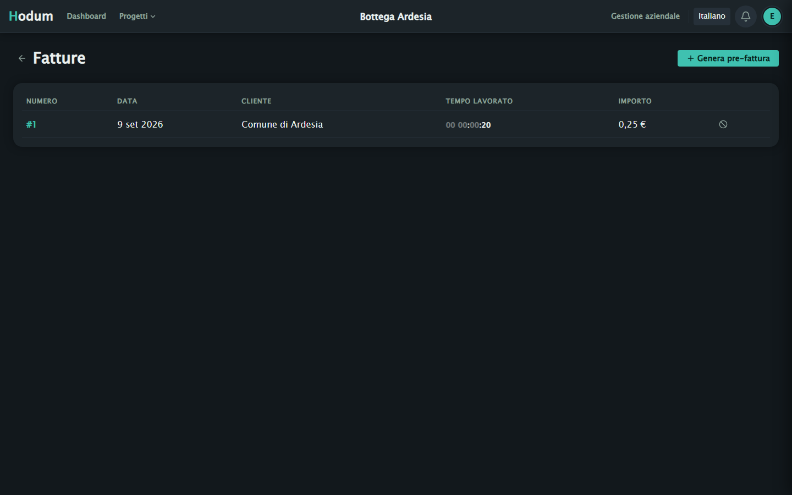

Una fattura generata per errore si **annulla** (icona ⊘ in fondo alla riga, non si elimina): resta nello storico segnata come annullata, ma i task collegati tornano immediatamente fatturabili. L'annullamento non riusa il numero: la prossima fattura avrà comunque il numero successivo.

### 7.4 Backup

Hodum può eseguire backup periodici del database aziendale (richiede `pg_dump` configurato lato server, vedi README).

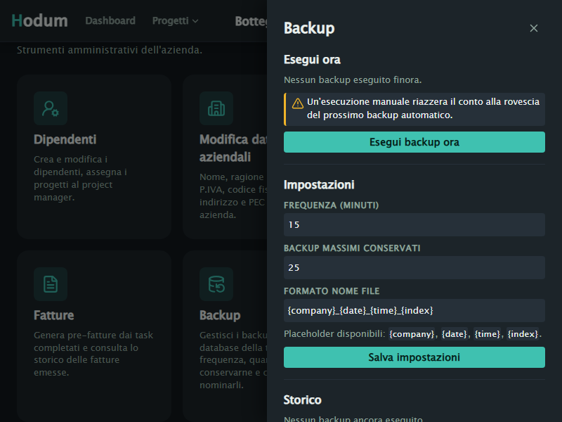

- **Esegui backup ora** — backup manuale immediato (riazzera il conto alla rovescia del prossimo backup automatico).
- **Impostazioni** — frequenza in minuti, numero massimo di backup da conservare (i più vecchi vengono eliminati automaticamente) e il formato del nome file, con segnaposto `{company}`, `{date}`, `{time}`, `{index}`.
- **Storico** — elenco dei backup eseguiti.

### 7.5 Esportare i dati dell'azienda

**"Esporta dati azienda"** scarica un JSON completo (azienda, dipendenti, progetti, task, commenti): è pensato per una **migrazione verso una nuova installazione** di Hodum, da caricare con "Importa azienda" nella schermata di registrazione (vedi [1.1](#11-creare-lazienda-registrazione)).

### 7.6 Eliminare l'azienda

Nella "Zona pericolosa" in fondo a Gestione aziendale: elimina **definitivamente** l'azienda, tutti i dipendenti, i progetti e lo stesso account owner. Per confermare va ridigitato il nome esatto dell'azienda.

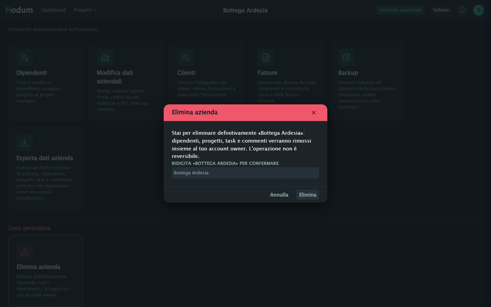

Non è reversibile: valuta prima un export completo (7.5) o un backup (7.4).

---

## 8. Assistente AI

Il fumetto in basso a destra apre un pannello laterale con un assistente conversazionale, a cui puoi fare domande sui tuoi progetti e task in linguaggio naturale.

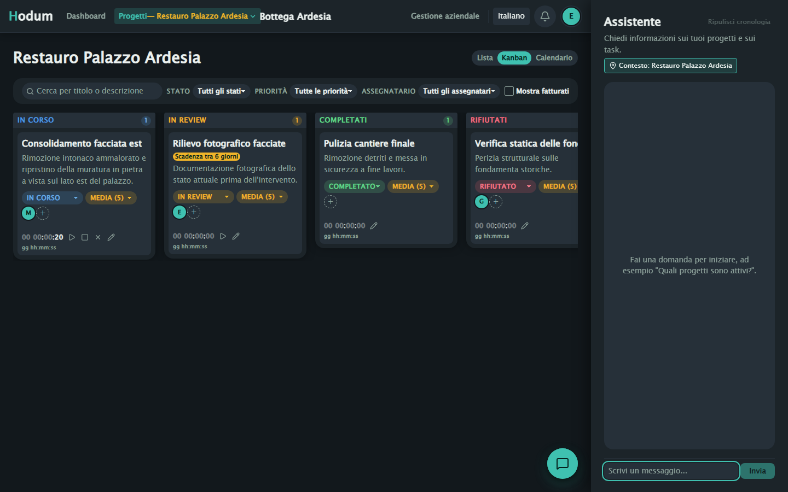

L'etichetta **"Contesto: \<nome pagina/progetto\>"** è un interruttore: quando è attiva, l'assistente sa automaticamente in quale pagina/progetto ti trovi e puoi fargli domande senza doverlo specificare ogni volta ("quanti task sono in corso?"); disattivandola, dovrai nominare esplicitamente progetto e task in ogni domanda.

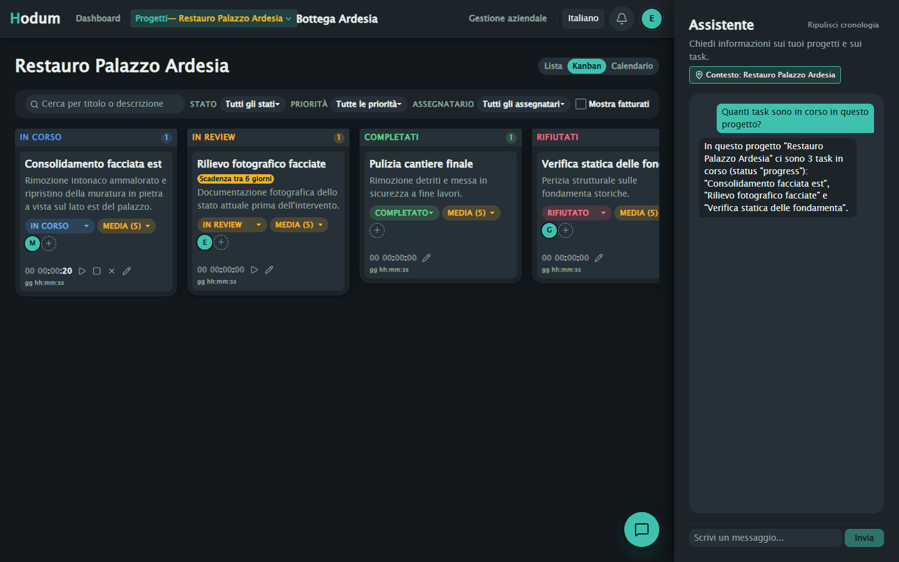

**"Ripulisci cronologia"** cancella la conversazione corrente e riparte da zero.

> **Attenzione:** l'assistente è un modello linguistico locale (Ollama) e può commettere errori o interpretare male una domanda, specialmente su conteggi o dettagli precisi. Trattalo come un aiuto per orientarti rapidamente, non come una fonte definitiva: per un dato che deve essere corretto al 100% (es. un importo di fattura), verificalo sempre nella schermata corrispondente.

---

## 9. Notifiche

La campanella in alto mostra un pallino con il numero di notifiche non lette. Hodum notifica automaticamente per:

- un commento su un task che ti riguarda;
- un nuovo task creato in un progetto che segui;
- un task in scadenza entro 7 giorni, o già scaduto;
- l'assegnazione di un intero progetto alla tua persona;
- l'assegnazione diretta di un task.

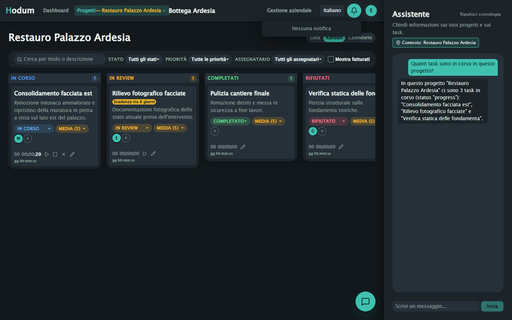

Da qui puoi anche segnare tutte le notifiche come lette in un solo click.

---

## 10. Profilo utente e lingua

Dall'avatar in alto a destra si apre il menu account, con il tuo nome, la tua email, l'ultimo accesso e due voci:

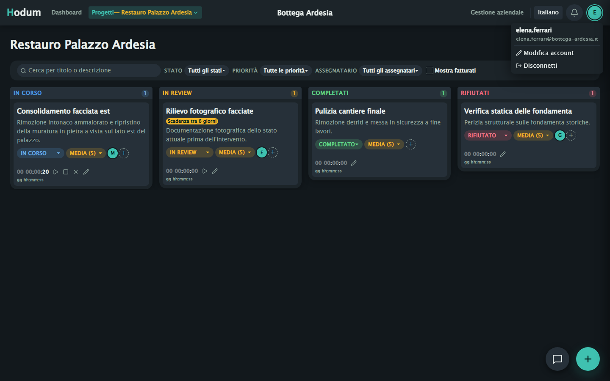

- **Modifica account** — nome, cognome, username, pronome, email e una nuova password (facoltativa). Da qui puoi anche **esportare i tuoi dati personali** (un JSON con le tue informazioni) o **eliminare il tuo account**.

  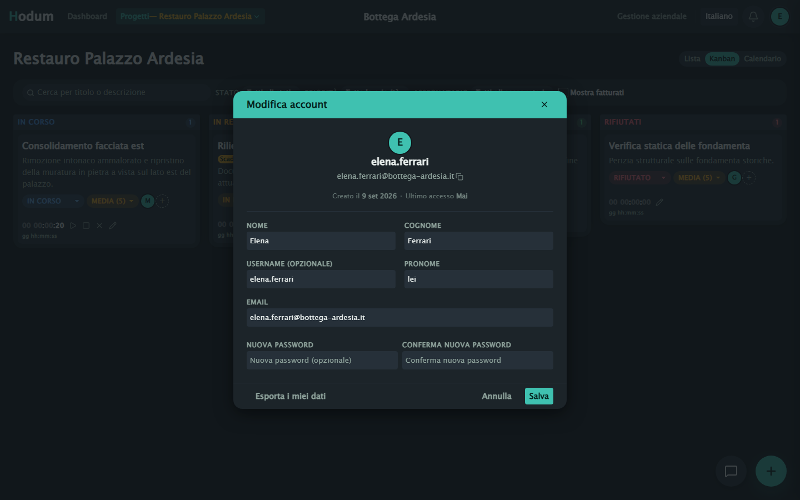

- **Disconnetti** — chiude la sessione corrente.

Il selettore accanto alla campanella cambia la lingua dell'interfaccia (Italiano/English) in ogni momento, senza bisogno di ricaricare la pagina.

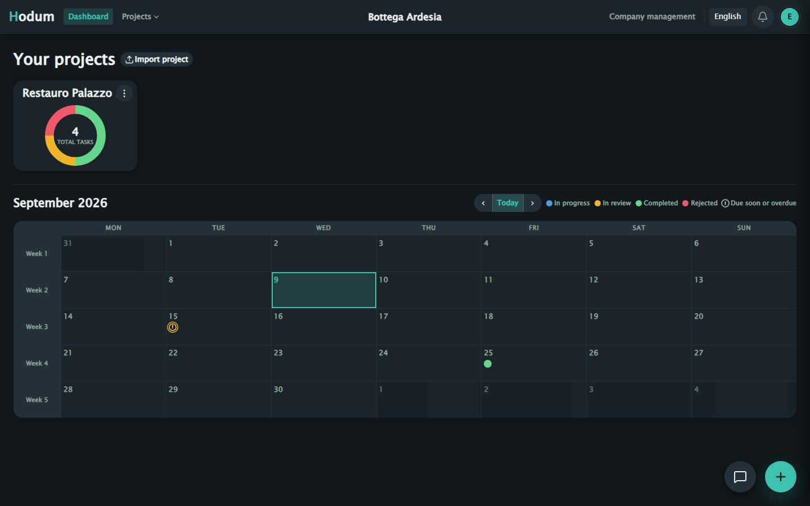

---

## 11. Domande frequenti

**Ho dimenticato la password e non trovo il codice di recupero. Cosa faccio?**
Senza il codice di recupero non è possibile reimpostare la password autonomamente (Hodum non usa email né servizi esterni per il reset, vedi [1.4](#14-password-dimenticata)): contatta l'owner della tua azienda, che può crearti un nuovo accesso o assisterti diversamente.

**Ho creato un dipendente e gli ho assegnato un task, ma lui vede "Nessun progetto ancora". Perché?**
Essere assegnatario di un task non basta: va assegnato anche il **progetto** da Dipendenti → menu ⋮ → "Assegna progetti" (vedi [3](#3-ruoli-e-permessi) e [6.2](#62-modificare-bloccare-ed-eliminare-un-dipendente)).

**Posso modificare un task dopo averlo fatturato?**
No: un task incluso in una pre-fattura confermata diventa di sola lettura (vedi [5.7](#57-task-fatturati-sola-lettura)). Se la fattura è sbagliata, annullala (vedi [7.3](#73-fatture)): il task torna modificabile e fatturabile.

**Che differenza c'è tra "Blocca" ed "Elimina" un dipendente?**
"Blocca" impedisce l'accesso mantenendo tutti i dati (reversibile, con "Riabilita"); "Elimina" rimuove definitivamente l'account e le sue assegnazioni (non reversibile). Per un dipendente che lascia l'azienda temporaneamente, o di cui non sei ancora sicuro, preferisci "Blocca".

**L'assistente AI mi ha dato una risposta che sembra sbagliata: è normale?**
Sì, può succedere (vedi [8](#8-assistente-ai)): è un modello linguistico locale, non un motore di query esatto. Verifica sempre i dati importanti nella schermata dedicata.
